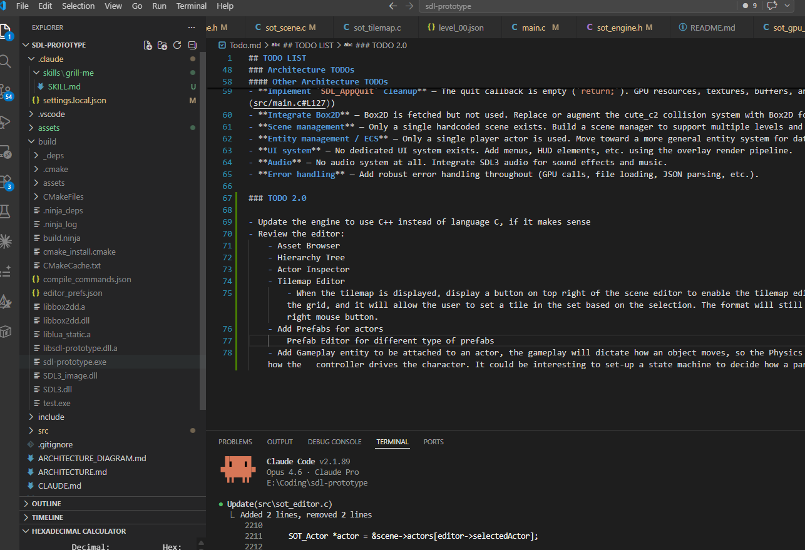

## TODO LIST

---

### Resume Context (last session: Feb 2026)

**What was built (in order):**
1. SDL3 GPU migration — Vulkan-backed multi-pipeline renderer (tilemap, sprite, debug, overlay passes)
2. Tilemap rendering — single draw call, vertex shader computes tile UVs, collision shapes from Tiled
3. Debug overlay — wireframe colliders with normal vectors (toggle key `1`)
4. Actor/animation system — JSON-defined animations, spritesheet atlas, per-frame GPU sprite updates
5. Scene descriptor system — `assets/scenes/*.json` files referencing a tiled map + spritesheets list
6. Sprite rendering shader — **WIP, left mid-way**

**Exact stopping point — `shaderSprite.vert` has two bugs:**
```glsl
// BUG 1: Y translation is never set (model[3][0] written twice)
model[3][0] = sprite.POSITION.x;
model[3][0] = sprite.POSITION.y;  // <-- must be model[3][1]

// BUG 2: undeclared variable (must be outTexCoord)
texCoord = uvOffset + (inTexCoord * vec2(spriteUVWidth, spriteUVHeight));
```

**And `SOT_GPU_RenderActors()` in `sot_scene.c` is empty** — the sprite draw call (bind SSBO, push uniforms, draw instanced) was never implemented.

**Next steps in order:**
1. Fix the two shader bugs above
2. Implement `SOT_GPU_RenderActors()` draw call body
3. Fill `gpuSpritesInfo[]` during `UpdateScene()` before GPU upload
4. Then continue with the code TODOs below

---

### Code TODOs (from source comments)

- **Implement a scene descriptor file** - The scene descriptor will provide the list of spriteshEets, the reference to the tilemap, the actors with information required to load each actor, and other scene specific data. It will be implemented using json format (similarly to the one we use for sprite animations)
- **Initialize the scene using the scene descriptor** - Initialize scene, tilemnap, actors, spritesheets from the scene descriptor file.
- **Fill the gpuSpritesInfo array on update** - The array must be filled in order to upload significant data to the GPU
- **Move actor SSBO upload out of render** — The storage buffer upload in `SOT_GPU_RenderActors` should be moved to the update phase. ([sot_scene.c:246](src/sot_scene.c#L246))
- [DONE] **Upload atlas to GPU** — Atlas upload step needs to be handled properly. ([sot_actor.c:33](src/sot_actor.c#L33)) - 
- [DONE]  **Initialize sprite rendering pipeline separately** — Move sprite pipeline init out of actor creation, probably into its own file. ([sot_actor.c:32](src/sot_actor.c#L32))
- **Remove Direction field from actor** — Make direction a property of the animation/action instead of the actor struct. ([sot_actor.c:19](src/sot_actor.c#L19))
- **Extract animation update logic** — Move animation update logic to a dedicated `UpdateAnimation` function, invoked from `UpdateActor`; rendering should happen after sprite state is updated. ([sot_actor.c:170](src/sot_actor.c#L170))
- **Load other actors in scene** — Scene loading currently only handles the player; support loading additional actors from scene data. ([sot_scene.c:54](src/sot_scene.c#L54))
- **Implement debug info for sprites** — The debug overlay flag is checked but no sprite debug info is drawn. ([sot_scene.c:299](src/sot_scene.c#L299))

### Architecture TODOs

#### GPU Pipeline Refactoring (High Priority)
- **Refactor SOT_GPU_Data with pipeline-specific nested structs** — Organize data by pipeline type (tilemap, sprite, textures) instead of mixing concerns. Improves clarity and eliminates wasted memory.
- **Refactor SOT_GPU_Buffers with dynamic nested structs** — Organize buffer resources by type (geometry, storage, textures) with dynamic arrays instead of fixed-size arrays.
- **Refactor SOT_GPU_State to use named pipeline/buffer members** — Replace indexed arrays with explicit named members for tilemap, sprite, overlay, and debug pipelines for type-safety.
- **Remove pipelineFlags bitmask** — No longer needed once SOT_GPU_State uses named members instead of indexed arrays.
- **Update all GPU pipeline functions** — Adapt map/upload functions to work with the new nested structure layout.
- **Clean up texture module** — Remove obsolete `GetTexture()` and `CreateTexture()` functions from sot_texture.c (only `GetSurfaceFromImage()` is still used).

#### Other Architecture TODOs
- **Implement `SDL_AppQuit` cleanup** — The quit callback is empty (`return;`). GPU resources, textures, buffers, and scenes are never freed, causing memory leaks. ([main.c:127](src/main.c#L127))
- **Integrate Box2D** — Box2D is fetched but not used. Replace or augment the cute_c2 collision system with Box2D for rigid body dynamics, joints, etc.
- **Scene management** — Only a single hardcoded scene exists. Build a scene manager to support multiple levels and transitions.
- **Entity management / ECS** — Only a single player actor is used. Move toward a more general entity system for data-driven game object creation.
- **UI system** — No dedicated UI system exists. Add menus, HUD elements, etc. using the overlay render pipeline.
- **Audio** — No audio system at all. Integrate SDL3 audio for sound effects and music.
- **Error handling** — Add robust error handling throughout (GPU calls, file loading, JSON parsing, etc.).

### TODO 2.0

- Update the engine to use C++ instead of language C, if it makes sense
- Review the editor:
    - [DONE] Asset Browser
    - [DONE]Hierarchy Tree
    - Actor Inspector
    - Tilemap Editor
        - When the tilemap is displayed, display a button on top right of the scene editor to enable the tilemap editor. basically it will show another dialog with the tileset, the grid, and it will allow the user to set a tile in the set based on the selection. The format will still be the one from tiled.a tile can be cleared pressing on the right mouse button.
    - Add Prefabs for actors
        Prefab Editor for different type of prefabs
    - 1Add Gameplay entity to be attached to an actor, the gameplay will dictate how an object moves, so the Physics engine setup, the fact it is connected to a controller and how the   controller drives the character. It could be interesting to set-up a state machine to decide how a particular actor behaves.
    